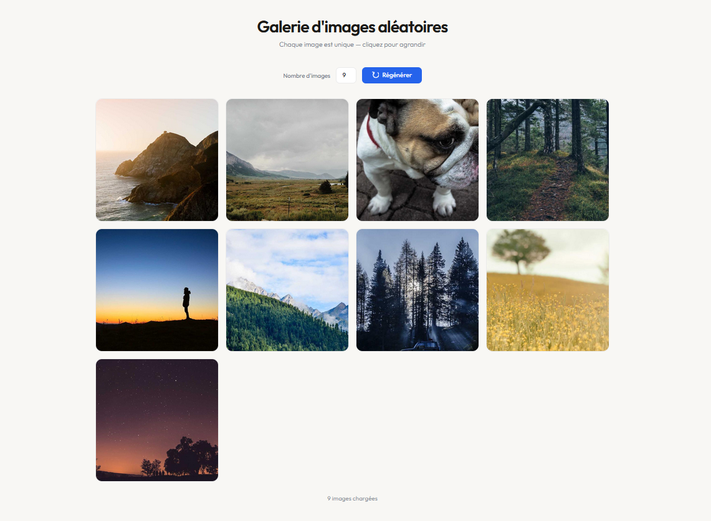

<div align="center">

# Galerie d'Images Aléatoires

Galerie responsive générée à la volée via l'API Picsum. Chaque image est unique — cliquez pour agrandir.


<br/>



</div>

---

## Fonctionnalités

- Génération aléatoire via [Picsum Photos](https://picsum.photos) — images toujours différentes
- Choix du nombre d'images — 6, 9, 12, 15 ou 20
- Skeleton shimmer pendant le chargement
- Lightbox au clic — fermeture bouton, clic extérieur ou `Échap`
- Compteur d'images chargées en temps réel
- Grille responsive — 2 colonnes sur mobile
- Sans dépendance externe

---

## Utilisation

Ouvre `Générateur aléatoire d'images/index.html` directement dans un navigateur — aucune installation requise.

---

## Structure

```
Générateur aléatoire d'images/
├── index.html   # Structure HTML
├── style.css    # Grille, skeleton, lightbox
└── script.js    # Génération, chargement, lightbox
```
